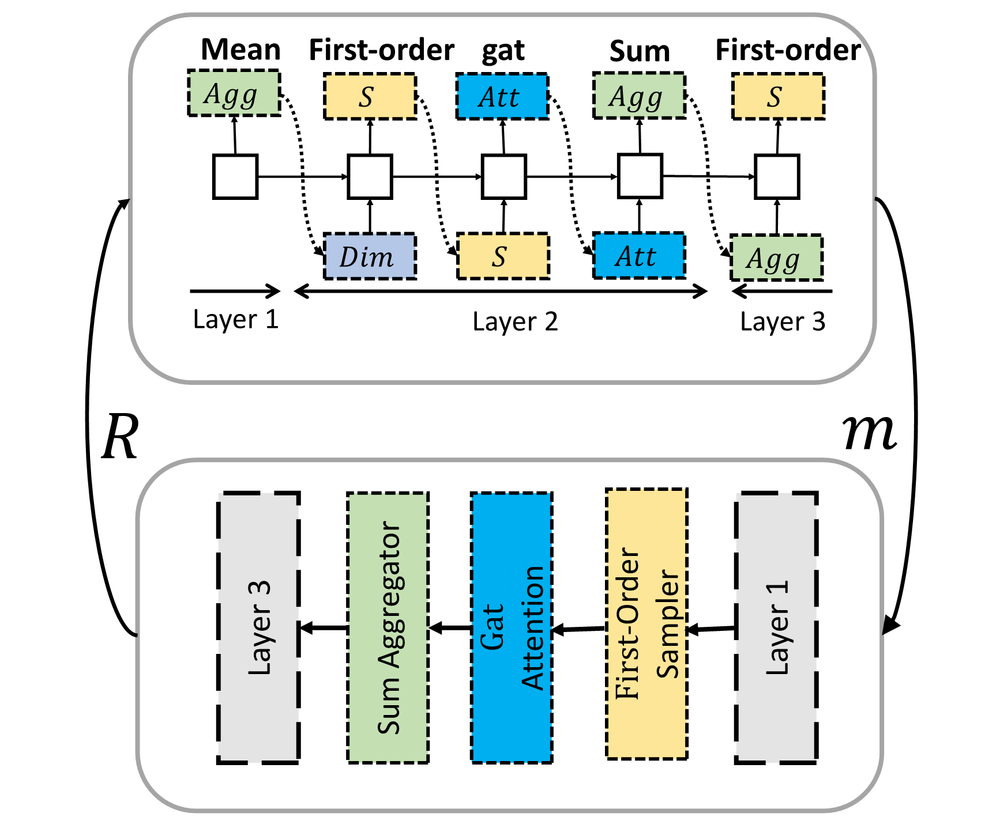

# GraphNAS-simple

#### Description
GraphNAS-simple is simple version of GraphNAS, and this project Provides the necessary components for GraphNAS to run on
citation dataset.

A simple illustration of GraphNAS. A recurrent network (the upper part) generates descriptions of graph neural architectures (the lower part), and then the validation results of the generated GNNs are used as feedback of the recurrent network (the upper part) to maximize the expected accuracy of the generated graph neural architecture (the lower part). The actions showed in current picture is not complete.

#### Installation
Ensure that at least PyTorch 1.0.0 is installed. Then run:
>  pip install -r requirements.txt

If you want to run in docker, you can run:
>  docker build -t graphnas -f DockerFile . \
>  docker run -it -v $(pwd):/GraphNAS graphnas python main.py --dataset cora

#### Software Architecture
* |--main.py Program entry, contains the parameters required by the program
* |--trainer.py Trainer manage the entire search process of GraphNAS, scheduling training of GNN_Controller. 
* |--models
* &nbsp;&nbsp; |--  gnn.py Generate GNN model according to GNN descriptions generated by GNN_Controller.
* &nbsp;&nbsp; |--  gnn_citation_manager.py Manage the training process of GNN on citation dataset and generate reward.  
* &nbsp;&nbsp; |--  gnn_controller.py Use RNN generate GNN descriptions. Train RNN according to reward.
* &nbsp;&nbsp; |--  operators.py Operators in current search space.
* &nbsp;&nbsp; |--  gnn_ppi_manager.py Manage the training process of GNN on ppi dataset.
* &nbsp;&nbsp; |--  geo GraphNAS implemented by pytorch-geometric. GNN implemented by PYG still has difference from GNN implemented by dgl. 
* |--eval 
* &nbsp;&nbsp; |--  eval_citation.py script for evaluate models designed by GraphNAS on Cora. 
* &nbsp;&nbsp; |--  eval_ppi.py script for evaluate models designed by GraphNAS on ppi. 
* &nbsp;&nbsp; |--  geo  script for evaluate models implemented by pytorch-geometric 

